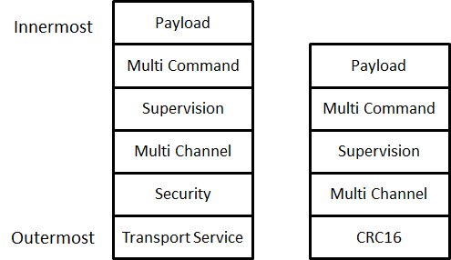

<!--
  generated-by: tools/pdf2md/convert.py
  pymupdf: 1.27.1
  source: SDS13783 Z-Wave Transport-Encapsulation Command Class Specification.pdf
  section: "2 Command Class Overview"
  pages: 10-13
-->
# 2 Command Class Overview

[General Command Class overview and rules are described in the Application Command Class Specification [13] and are valid for the Command Classes presented in this document.](03-command-class-definitions/03.09-transport-service-command-class-version-2.md#3925-losing-segmentcomplete)

The following subsections present the additional considerations relating to the Encapsulation Command Classes.

Encapsulation Command Classes support/control

A node MUST advertise support for Multi Channel Command Class only if it implements End Points. A node able to communicate using the Multi Channel encapsulation but implementing no End Point MUST NOT advertise support for the Multi Channel Command Class.

A node able to receive commands encapsulated with the Transport Service, Security (S0/S2) or CRC-16 Command Class MUST advertise the respective Command Class as supported and MUST also be able to send commands encapsulated with the respective Command Class.

[The Command Class support/control definition presented in [13] applies to the Supervision Command](03-command-class-definitions/03.09-transport-service-command-class-version-2.md#3925-losing-segmentcomplete) Class.

Node Information Frame

[For the NIF definition, refer to [13].](03-command-class-definitions/03.09-transport-service-command-class-version-2.md#3925-losing-segmentcomplete)

The NIF represents the Root Device’s Command Class capabilities when using no Security encapsulation.

[Multi Channel Root Devices MUST advertise their non-secure capabilities via the NIF. Multi Channel End Points MUST advertise their non-secure capabilities via the Multi Channel Capability Report Command.](03-command-class-definitions/03.02-multi-channel-command-class-version-3.md#326-multi-channel-capability-report-command)

[Security bootstrapped nodes MUST advertise their capabilities using security encapsulation (for both Root Devices and End Points) via the Security Commands Supported Report Command or the Security 2](03-command-class-definitions/03.05-security-0-s0-command-class-version-1/03.05.04-encapsulated-command-class-handling.md#3543-security-commands-supported-report-command) [Commands Supported Report Command.](03-command-class-definitions/03.06-security-2-s2-command-class-version-1/03.06.08-discovery-of-security-capabilities-commands.md#3682-security-2-commands-supported-report-command)

Multi Channel overview

The section presents the concept of Multi Channel End Points. The concept ties closely to command classes such as Multi Channel Command Class, Multi Channel Association Command Class, Association Group Information Command Class as well as the Z-Wave Plus Icon Type. Multi Channel functionality may be used for controlling as well as for supporting devices.

Terminology

A Z-Wave node is conceptually an application resource in a plastic box communicating via a Z-Wave radio. Composite devices pack multiple application resources in the same plastic box, thus sharing the same Z-Wave radio. Application resources can always be addressed individually.

Within a network, a Z-Wave node is identified by its NodeID. The NodeID represents the plastic box and the radio. Multi-resource devices are organized as Multi Channel End Points. Each application resource is identified by its own unique End Point. The plastic box itself is referred to as the Root Device.

Multi Channel Encapsulation allows a sending node to specify a source End Point and a destination End Point. Further, the destination End Point may be structured as a multicast mask, targeting up to 7 End Points by one command. Multi Channel Encapsulation is used for transmission from one End Point to another, from an End Point to a Root Device as well as from a Root Device to an End Point.

[silabs.com | Building a more connected world.](https://www.silabs.com/) PAGE 10 OF 118 SDS13783-14 Z-Wave Transport-Encapsulation Command Class Specification 2020-07-06 Multi Channel Encapsulation is not used between Root Devices.

An Aggregated End Point implements a function which relates to multiple individual End Points. An Aggregated End Point is addressed just as an individual End Point. One example of an Aggregated End Point is a common power meter of a power strip which measures the total power consumption of all End Points. The aggregation of End Points should not be confused with multicast addressing. Sending a Meter Reset command via multi-End Point addressing to all individual End Points causes all individual End Points to reset their individual meters. Sending a Meter Reset command to the Aggregated End Point causes the common power meter to be reset.

Bridging devices may provide connectivity to other technologies than Z-Wave via dynamic End Points. Dynamic End Points may be created, changed or removed.

A controlling device MAY use Multi Channel encapsulation to communicate with Multi Channel End Points in other devices. If such a controlling device does not implement any End Points, the device MUST NOT advertise the Multi Channel Command Class in the Node Information Frame.

One may create a Multi Channel Association to allow an End Point to control another End Point. The End Point may also control a Root Device. Likewise, a Multi Channel Association may be created to allow a Root Device to control an End Point.

The Association Group Information advertises the association capabilities of each Association Group in each End Point as well as in the Root Device.

Backwards compatibility

The Multi Channel concept provides a toolbox for sub-addressing. Any controlling device should implement the functionality required to interact with supporting Multi Channel devices.

Legacy devices only understand the concept of the Root Device. Therefore, a Multi Channel device providing multiple application resources also provides a meaningful subset of the application functionality via the Root Device on behalf of one or more End Points.

One example is a composite temperature and humidity sensor, which exposes the temperature sensor functionality via the Root Device as if the device was a stand-alone temperature sensor.

Another example is a 5-output power strip implemented as 5 Multi Channel End Points. The Root Device exposes one Binary Switch resource but a command to the Root Device spawns internal control commands to all outputs, so the Root Device acts as a master switch.

It is seen that the mapping of application functionality to the Root Device depends heavily on the actual product feature set. However, a few principles apply:

1. The Root Device provides access to the primary functionality of the actual product.

2. The Root Device of a Multi Channel device does not implement any application functionality that cannot be reached via End Points.

3. The Root Device of a Multi Channel always presents functionality, which can also be reached via End Point 1. If it makes sense in the actual product, a Root Device command may affect more End Points than End Point 1.

As it is optional how to forward commands from the Root Device to multiple End Points, one cannot be sure that a command to the Root Device will target all End Points. The Multi Channel multicast feature may be used to send a Set command to the first 7 End Points. Alternatively, one may communicate to each individual End Point. This works for Set as well as Get commands.

[silabs.com | Building a more connected world.](https://www.silabs.com/) PAGE 11 OF 118 SDS13783-14 Z-Wave Transport-Encapsulation Command Class Specification 2020-07-06 GUI presentation

The Root Device always advertises application functionality, even when the application functionality is actually provided by forwarding commands to one or more End Points of the device.

Management tools may have a need to present expanded views of Multi Channel devices, e.g. in the floor plan view of a smart home deployment. By ignoring application-style Command Classes supported by one or more End Points, the Root Device can be presented the way it really works.

Applicability examples

 A gateway may target a destination End Point to control the individual output of a power strip

 A gateway may create a Multi Channel Association from the Root Device Lifeline association group of a two-channel indoor/outdoor temperature sensor to receive sensor reports. The Multi Channel encapsulation source End Point allows the gateway to distinguish indoor readings from outdoor readings.

 One End Point of a dual End Point indoor/outdoor temperature sensor may have a (non-Multi Channel) association created to control the Root Device of an air conditioner on basis of the measured indoor temperature.

Encapsulation order overview

Command Class encapsulation MUST be applied in the following order:

1. Encapsulated Command Class (payload), .e.g Basic Set 2. Multi Command 3. Supervision 4. Multi Channel 5. Any one of the following combinations: a. Security (S0 or S2) followed by transport service b. Transport Service c. Security (S0 or S2) d. CRC16

[The encapsulation order is also shown in Figure 1](02-command-class-overview.md#2-command-class-overview)

[An exception to Figure 1 is made when querying Multi Channel End Points about their secure](02-command-class-overview.md#2-command-class-overview) [capabilities. In this case, the S0/S2 Security Commands Supported Report Command is carried in a Multi](03-command-class-definitions/03.05-security-0-s0-command-class-version-1/03.05.04-encapsulated-command-class-handling.md#3543-security-commands-supported-report-command)

[silabs.com | Building a more connected world.](https://www.silabs.com/) PAGE 12 OF 118 SDS13783-14 Z-Wave Transport-Encapsulation Command Class Specification 2020-07-06 Channel encapsulation Command, thus, the encapsulation order is: Security (Multi Channel (Security Commands Supported Get Command))

Responses to a given frame MUST be carried out using the same encapsulation or lack of encapsulation as it was received, unless specified otherwise in the Command Class specification.

The Transport Service Command Class and Multi Command Command Class are exceptions to the above rule.

The transport service MUST be used only if the payload does not fit in the Z-Wave MAC frame size.

The Multi Command Command Class is optional to use and SHOULD be used only if several commands are queued for transmission.
